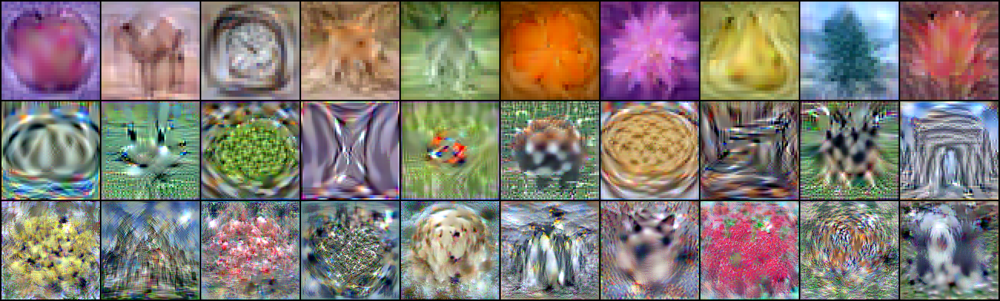
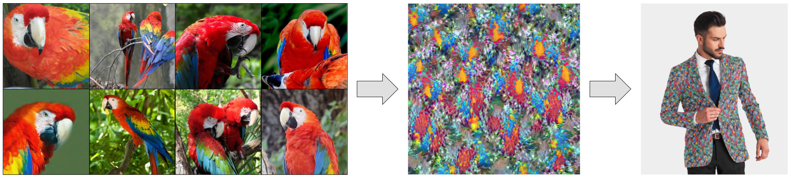
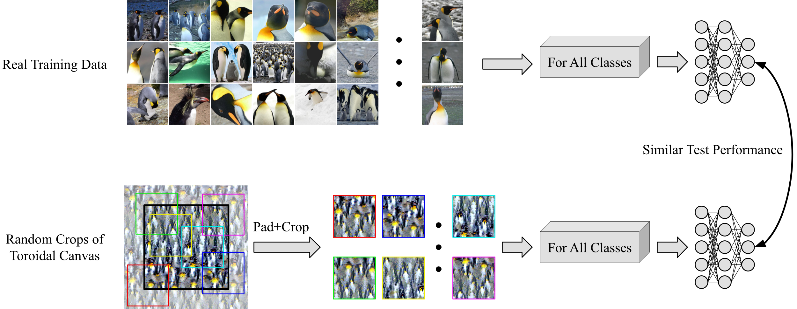
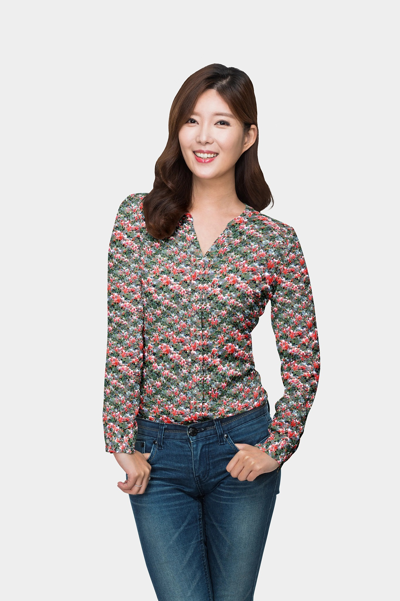
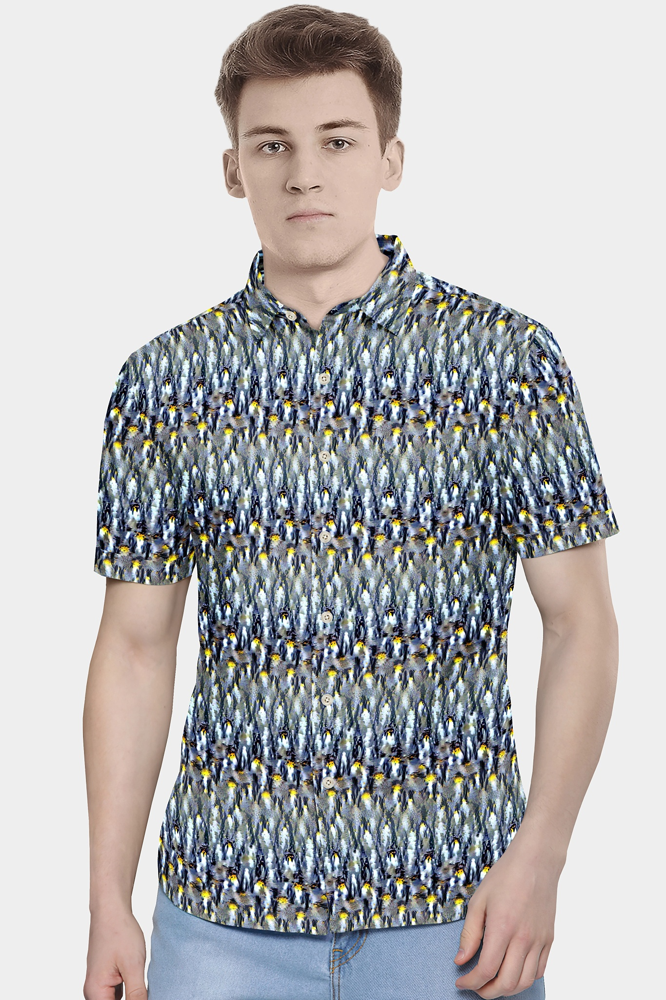
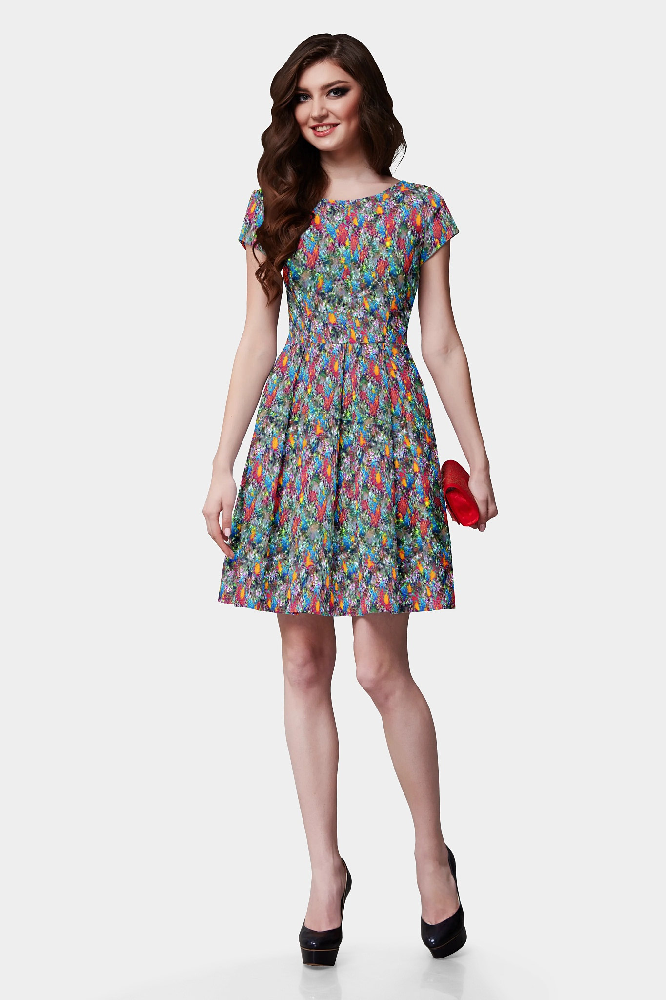
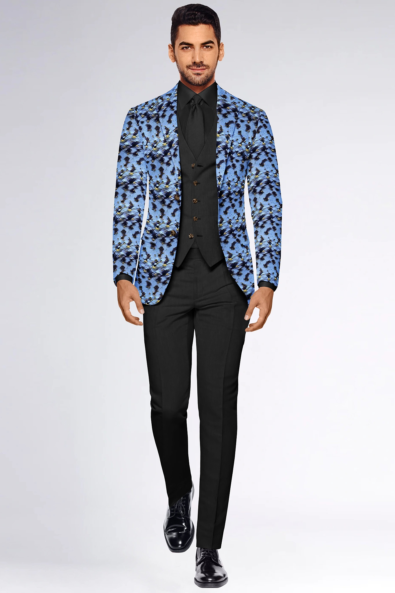
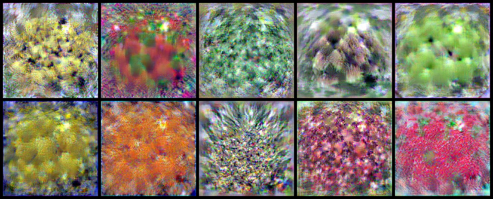

# Dataset Distillation by Matching Training Trajectories

### [Project Page](https://georgecazenavette.github.io/mtt-distillation/) | [Paper](https://arxiv.org/abs/2203.11932)
<br>



This repo contains code for training expert trajectories and distilling synthetic data from our Dataset Distillation by Matching Training Trajectories paper (CVPR 2022). Please see our [project page](https://georgecazenavette.github.io/mtt-distillation) for more results.


> [**Dataset Distillation by Matching Training Trajectories**](https://georgecazenavette.github.io/mtt-distillation/)<br>
> [George Cazenavette](https://georgecazenavette.github.io/), [Tongzhou Wang](https://ssnl.github.io/), [Antonio Torralba](https://groups.csail.mit.edu/vision/torralbalab/), [Alexei A. Efros](https://people.eecs.berkeley.edu/~efros/), [Jun-Yan Zhu](https://www.cs.cmu.edu/~junyanz/)<br>
> CMU, MIT, UC Berkeley<br>
> CVPR 2022 (Oral)

The task of "Dataset Distillation" is to learn a small number of synthetic images such that a model trained on this set alone will have similar test performance as a model trained on the full real dataset.


Our method distills the synthetic dataset by directly optimizing the fake images to induce similar network training dynamics as the full,
real dataset. We train "student" networks for many iterations on the synthetic data,
measure the error in parameter space between the "student" and "expert" networks trained on real data,
and back-propagate through all the student network updates to optimize the synthetic pixels.


## Wearable ImageNet: Synthesizing Tileable Textures



Instead of treating our synthetic data as individual images, we can instead encourage every random crop (with circular padding) on a larger canvas of pixels to induce a good training trajectory. This results in class-based textures that are continuous around their edges.



Given these tileable textures, we can apply them to areas that require such properties, such as clothing patterns.



Visualizations made using <a href="https://tri3d.in/">FAB3D</a>
<br>


### Getting Started

First, download our repo:
```bash
git clone https://github.com/GeorgeCazenavette/mtt-distillation.git
cd mtt-distillation
```

For an express instillation, we include ```.yaml``` files.

If you have an RTX 30XX GPU (or newer), run

```bash
conda env create -f requirements_11_3.yaml
```

If you have an RTX 20XX GPU (or older), run

```bash
conda env create -f requirements_10_2.yaml
```

You can then activate your  conda environment with
```bash
conda activate distillation
```
##### Quadro Users Take Note:
```torch.nn.DataParallel``` seems to not work on Quadro A5000 GPUs, and this may extend to other Quadro cards.

If you experience indefinite hanging during training, try running the process with only 1 GPU by prepending ```CUDA_VISIBLE_DEVICES=0``` to the command.

### Generating Expert Trajectories
Before doing any distillation, you'll need to generate some expert trajectories using ```buffer.py```

The following command will train 100 ConvNet models on CIFAR-100 with ZCA whitening for 50 epochs each:
```bash
python buffer.py --dataset=CIFAR100 --model=ConvNet --train_epochs=50 --num_experts=100 --zca --buffer_path={path_to_buffer_storage} --data_path={path_to_dataset}
```
We used 50 epochs with the default learning rate for all of our experts.
Worse (but still interesting) results can be obtained faster through training fewer experts by changing ```--num_experts```. Note that experts need only be trained once and can be re-used for multiple distillation experiments.

### Distillation by Matching Training Trajectories
The following command will then use the buffers we just generated to distill CIFAR-100 down to just 1 image per class:
```bash
python distill.py --dataset=CIFAR100 --ipc=1 --syn_steps=20 --expert_epochs=3 --max_start_epoch=20 --zca --lr_img=1000 --lr_lr=1e-05 --lr_teacher=0.01 --buffer_path={path_to_buffer_storage} --data_path={path_to_dataset}
```


Please find a full list of hyper-parameters below:


### ImageNet
Our method can also distill subsets of ```ImageNet``` into low-support synthetic sets.

When generating expert trajectories with ```buffer.py``` or distilling the dataset with ```distill.py```, you must designate a named subset of ImageNet with the ```--subset``` flag.

For example,

```bash
python distill.py --dataset=ImageNet --subset=imagefruit --model=ConvNetD5 --ipc=1 --res=128 --syn_steps=20 --expert_epochs=2 --max_start_epoch=10 --lr_img=1000 --lr_lr=1e-06 --lr_teacher=0.01 --buffer_path={path_to_buffer_storage} --data_path={path_to_dataset}
```
will distill the ```imagefruit``` subset (at 128x128 resolution) into the following 10 images



To register your own ImageNet subset, you can add it to the ```Config``` class at the top of ```utils.py```.

Simply create a list with the desired class ID's and add it to the dictionary.

[This gist](https://gist.github.com/yrevar/942d3a0ac09ec9e5eb3a) contains a list of all 1k ImageNet classes and their corresponding numbers.


### Texture Distillation
You can also use the same set of expert trajectories (except those using ZCA) to distill classes into toroidal textures by simply adding the ```--texture``` flag.

For example,

```bash
python distill.py --texture --dataset=ImageNet --subset=imagesquawk --model=ConvNetD5 --ipc=1 --res=256 --syn_steps=20 --expert_epochs=2 --max_start_epoch=10 --lr_img=1000 --lr_lr=1e-06 --lr_teacher=0.01 --buffer_path={path_to_buffer_storage} --data_path={path_to_dataset}
```
will distill the ```imagesquawk``` subset (at 256x256 resolution) into the following 10 textures


## Acknowledgments
We would like to thank Alexander Li, Assaf Shocher,  Gokul Swamy, Kangle Deng, Ruihan Gao, Nupur Kumari, Muyang Li, Gaurav Parmar, Chonghyuk Song, Sheng-Yu Wang, and Bingliang Zhang as well as Simon Lucey's Vision Group at the University of Adelaide for their valuable feedback. This work is supported, in part, by the NSF Graduate Research Fellowship under Grant No. DGE1745016 and grants from J.P. Morgan Chase, IBM, and SAP. Our code is adapted from https://github.com/VICO-UoE/DatasetCondensation

## Related Work
<ol>
<li>
    Tongzhou Wang et al. <a href="https://ssnl.github.io/dataset_distillation/">"Dataset Distillation"</a>, in arXiv preprint 2018
</li>
<li>
    Bo Zhao et al. <a href="https://arxiv.org/abs/2006.05929">"Dataset Condensation with Gradient Matching"</a>, in ICLR 2020
</li>
<li>
    Bo Zhao and Hakan Bilen. <a href="https://arxiv.org/abs/2102.08259">"Dataset Condensation with Differentiable Siamese Augmentation"</a>, in ICML 2021
</li>
<li>
    Timothy Nguyen et al. <a href="https://arxiv.org/abs/2011.00050">"Dataset Meta-Learning from Kernel Ridge-Regression"</a>, in ICLR 2021
</li>
<li>
    Timothy Nguyen et al. <a href="https://arxiv.org/abs/2107.13034">"Dataset Distillation with Infinitely Wide Convolutional Networks"</a>, in NeurIPS 2021
</li>
<li>
    Bo Zhao and Hakan Bilen. <a href="https://arxiv.org/abs/2110.04181">"Dataset Condensation with Distribution Matching"</a>, in arXiv preprint 2021
</li>
<li>
    Kai Wang et al. <a href="https://arxiv.org/abs/2203.01531">"CAFE: Learning to Condense Dataset by Aligning Features"</a>, in CVPR 2022
</li>
</ol>

# Reference
If you find our code useful for your research, please cite our paper.
```
@inproceedings{
cazenavette2022distillation,
title={Dataset Distillation by Matching Training Trajectories},
author={George Cazenavette and Tongzhou Wang and Antonio Torralba and Alexei A. Efros and Jun-Yan Zhu},
booktitle={Proceedings of the IEEE/CVF Conference on Computer Vision and Pattern Recognition},
year={2022}
}
```

```
@iniroceedings{
cazenavette2022textures,
title={Wearable ImageNet: Synthesizing Tileable Textures via Dataset Distillation},
author= {George Cazenavette and Tongzhou Wang and Antonio Torralba and Alexei A. Efros and Jun-Yan Zhu},
booktitle={Proceedings of the IEEE/CVF Conference on Computer Vision and Pattern Recognition (CVPR) Workshops},
year={2022},
}
```
